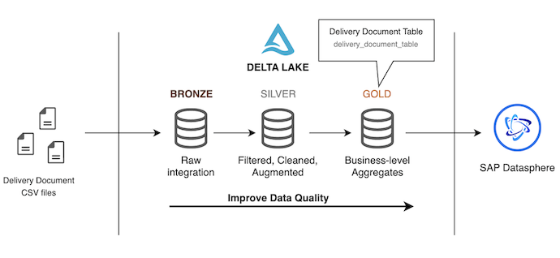
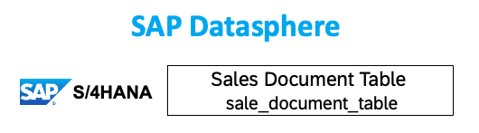
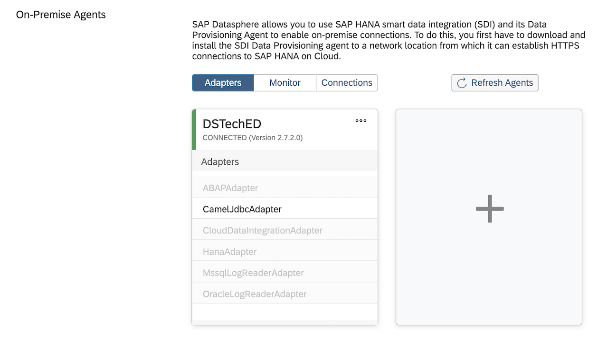
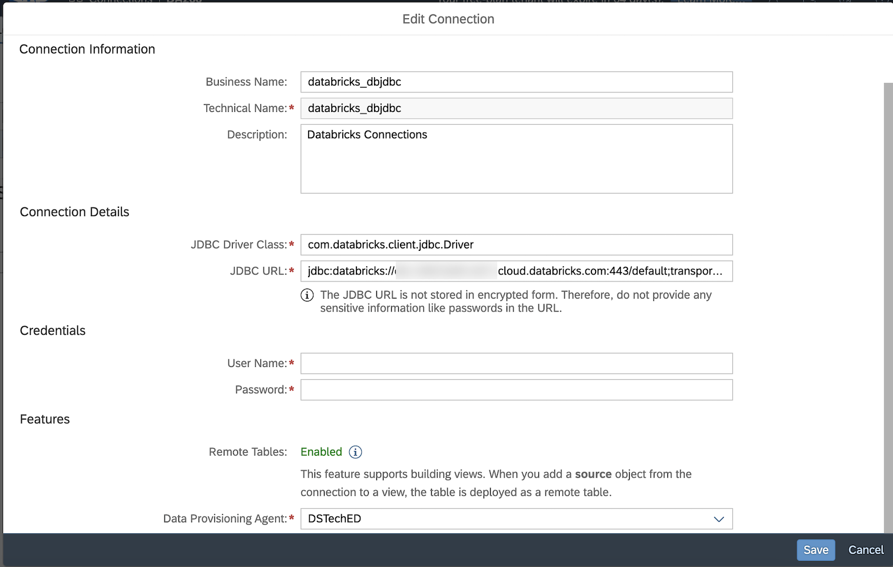
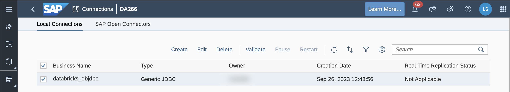
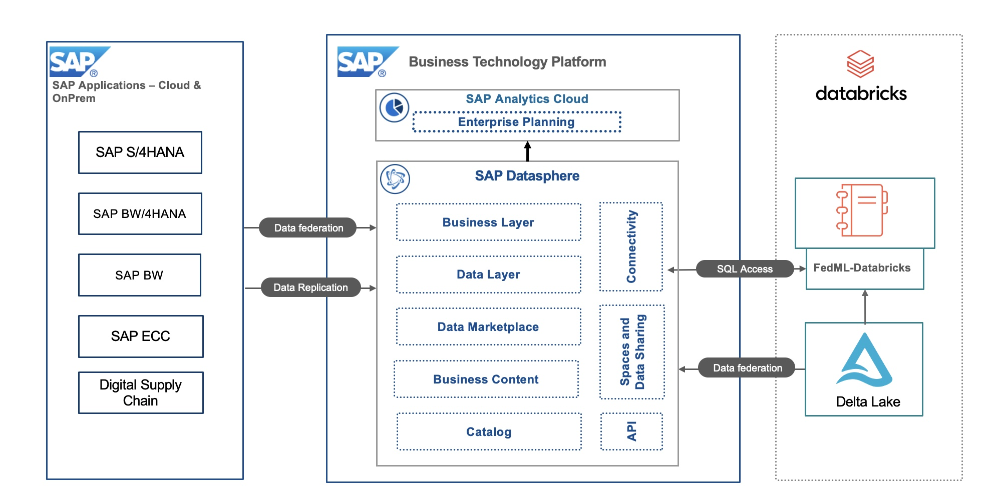

# Discover - Understand SAP Datasphere and Databricks setup and given data models

> **IMPORTANT**: This section is for informational purposes only and does not require any actions to be taken by the participants. Its aim is to provide a better understanding of the preconfigurations. The goal is to provide a clear understanding of the concepts and techniques involved, without the need for any hands-on implementation.

## Role of SAP Business Technology Platform (SAP BTP)
 - With SAP Datasphere, customers can federate queries across source systems (SAP and Google) without the need for data replication. 
 - SAP Analytics Cloud (SAC) customers can execute live on the fly analysis across cross-cloud data sources in real-time (and live analytics to SAP HANA systems).
 - Unified SAP data model and semantics propagated from SAP S/4HANA and SAP CX systems to SAP Datasphere and SAC

## Role of Databricks
 -  Serve as a powerful data processing and ETL (Extract, Transform, Load) platform to prepare the data for analytics. ​
 - Perform real-time processing on incoming data streams from SAP Datasphere.​
 - Store the processed data in a suitable format, such as Delta Lake, which is optimized for both batch and real-time processing.​
 - Optimize query performance through features like query optimization and caching to make real-time analytics in SAP Analytics Cloud responsive and efficient.​

In this hands-on session, you will work with a sample Databricks dataset. 
To analyze sales order management you can combine external source systems like Databricks and federate data from it to get real-time data.

To achieve this we have created data sets of Databricks. In Databricks, data sets are pre-loaded and publicly accessible data sets. You can use them to develop and test your queries, and/or gain insights into a variety of topics.

## Databricks Model Overview
​

## SAP S/4HANA Sample Sales Data loaded in SAP Datasphere
​

## Overview - Establishing live data integration between Databricks and SAP Datasphere

In order to establish live data integration between SAP Datasphere and Databricks SQL, the Data Provisioning Agent(DP agent) has to be installed on a virtual machine and configured. For DP agent installation, you can refer the [Install the Data Provisioning Agent](https://help.sap.com/docs/SAP_DATASPHERE/9f804b8efa8043539289f42f372c4862/8f6185069a51404ebf23c684fee8cf39.html) link. 

To connect the DP agent to the SAP HANA Cloud tenant of SAP Datasphere, you can follow the [Connect and Configure the Data Provisioning Agent](https://help.sap.com/docs/SAP_DATASPHERE/9f804b8efa8043539289f42f372c4862/e87952d7c656477cb5558e5c2f44ae9c.html) link.

When all the steps were completed, the status of the DP agent will be displayed as “Connected”. In our case, the DP agent is DSTechED.

[Connections](https://help.sap.com/docs/SAP_DATASPHERE/be5967d099974c69b77f4549425ca4c0/eb85e157ab654152bd68a8714036e463.html) provide access to data from a wide range of sources, cloud as well as on-premise sources, SAP and Non-SAP sources, and partner tools. They allow space members to use entities from the connected source to acquire, prepare and access data from those sources in SAP Datasphere.

In the "Connections" section of SAP Datasphere we already created live connectivity to Databricks by providing 
1. Any business and technical name for connection information 
2. Connection details with JDBC Driver Class and URL.
3. Databricks user account or token credential.
4. Data provisioning agent that we have activated already.

This connection is used in the next steps of Hands-on challenges to create data views on remote tables from Databricks.

> IMPORTANT: Please note, that for this hands-on session, you will not have permission to see the connection in your account like shown in a image below, nevertheless, you can explore how such a connection can be established.

## Solution Overview

The architecture below highlights the main purpose of this integration, federating data residing in Databricks delta lake into SAP Datasphere. ​
We do this to achieve richer analytics by incorporating data that would otherwise remain unused in 3rd party systems with the already valuable insights delivered by SAP data. ​
We show the different mechanisms by which data can be federated and used in SAP Analytics Cloud without being replicated.​

​

## Summary

The goal of this introduction was to give a clear understanding of the concepts and techniques involved in creating a Datasphere live data connection to Google BigQuery and exploring the provided data model. 

Continue to - [Exercise 1 -  Build and expose data views on SAP Datasphere](../ex1/README.md)
