# Exercise 1 - Build and expose data views on SAP Datasphere

In this exercise, your objective is to create and display data views on SAP Datasphere by federating the data from Databricks. This process involves leveraging the rich data stored in Databricks and integrating it into your SAP Datasphere using DP Agent for analysis and reporting purposes in real-time. At the end of the exercise, the created views will be exposed and can be accessed from SAP Analytics Cloud(SAC) to build interactive dashboards and generate valuable insights. By combining the capabilities of SAP Datasphere and SAP Analytics Cloud, you can gain a holistic view of your data, facilitating well-informed decision-making.

## Exercise 1.1 Creating a view "Unified Sales Delivery View"

This exercise focuses on building a new data view called **"Unified Sales Delivery View"** by combining and aggregating the **"sales_document_table"** and **"nce"** tables. This involves joining the two tables to create a holistic view of the sales delivery data and aggregating it by Reference/Sales Document and Reference/Sales Item Document to provide insights into sales delivery of goods and items.

To complete this exercise, you will need to follow these steps:

1. Join the "sales_document_table" with the "delivery_document_table" , using a common field such as "Reference/Sales Document" and "Reference/Sales Item Document" respectively.
   >HINT: you need to create an INNER Join
2. Identify the missing measures from the attributes and move them to measures
   >HINT: attributes: DeliveredQuantity, OrderQuantity and ItemPrice

Your goal is to navigate through these steps and create a comprehensive data view that accurately reflects product sales and discounts by country and date. Best of luck!

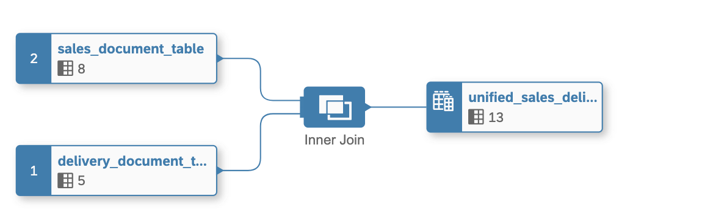

### Step by Step Solution Guide

Refer to the provided solution below for a detailed, step-by-step guide on how to complete Exercise 1.1.
1. 👉 Open your [SAP Datasphere](https://a4d7e443-c962-4380-a0cb-53e3d6aca317.ap11.hcs.cloud.sap/dwaas-ui/index.html#/home) using the provided credentials.

      Your user is associated with unique space (TECHED_<USER_NO>) where you can work and create your data artifacts.

      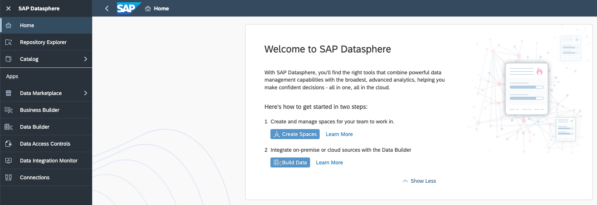

2. 👉 Go to **SAP Datasphere Data Builder** and create **New Graphical View**

      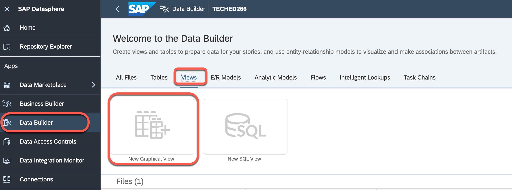

3. 👉 Navigate to the **Shared Objects** from Repository, expand the tables and drag and drop the following 2 tables into the canvas

    - sales_document_table
    - delivery_document_table

    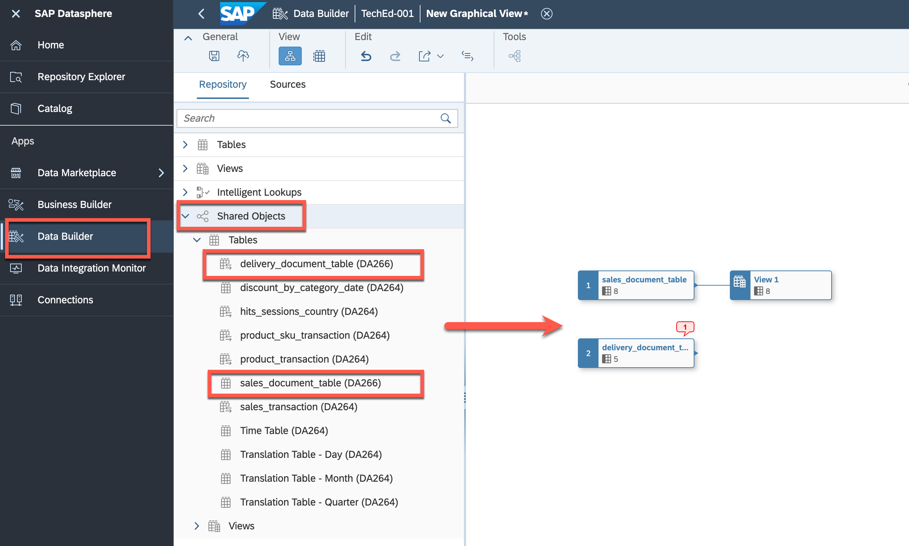

4. 👉 Drag and move **delivery_document_table** on top of **sales_document_table** to create a **JOIN**

    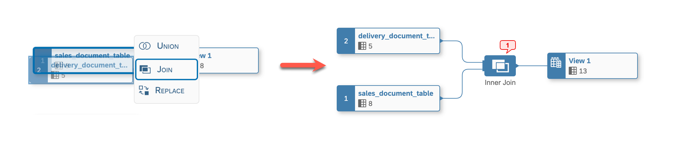

5. 👉 Define the following **JOIN** conditions:
    
    - Join Type: *Inner*
    - Mappings (see screenshot): ReferenceDocument -> SalesDocument, ReferenceItemDocument -> SalesDocumentItem

    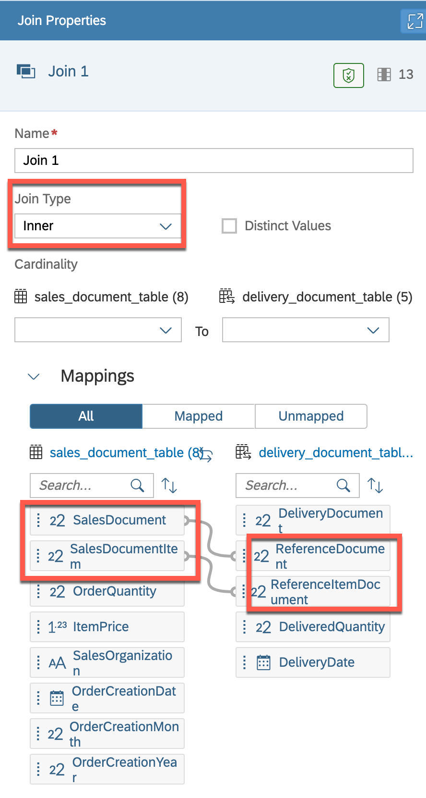

6. 👉 Keep the Projection columns unchanged

7. 👉 Finalyse the view by giving a name, semantic type and expose for consumption
    
    - Business Name: *unified_sales_delivery_view*
    - Technical Name: *unified_sales_delivery_view*
    - Semantic Usage: *Fact*
    - Expose for Consumption: *On*

    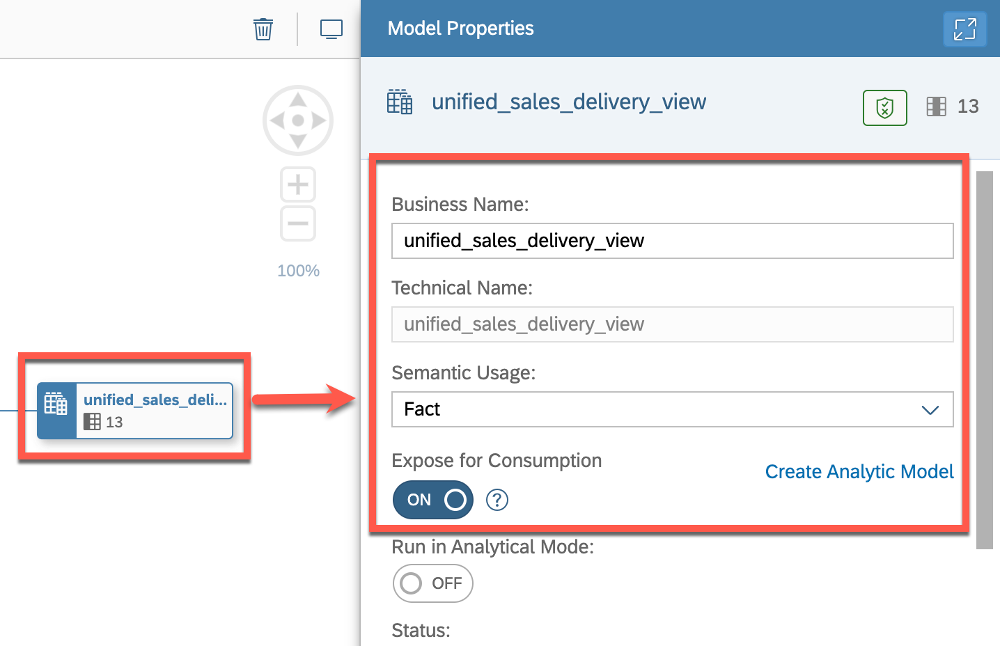

8. 👉 Move **DeliveredQuantity**, **OrderQuantity** and **ItemPrice** attributes to **Measures**

    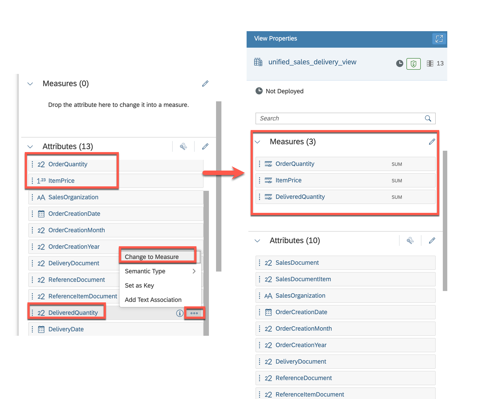

9. 👉 Now as we have successfully created the new view "unified_sales_delivery_view".

    To view the final data in **unified_sales_delivery_view** view, click on the Data Viewer Icon.

    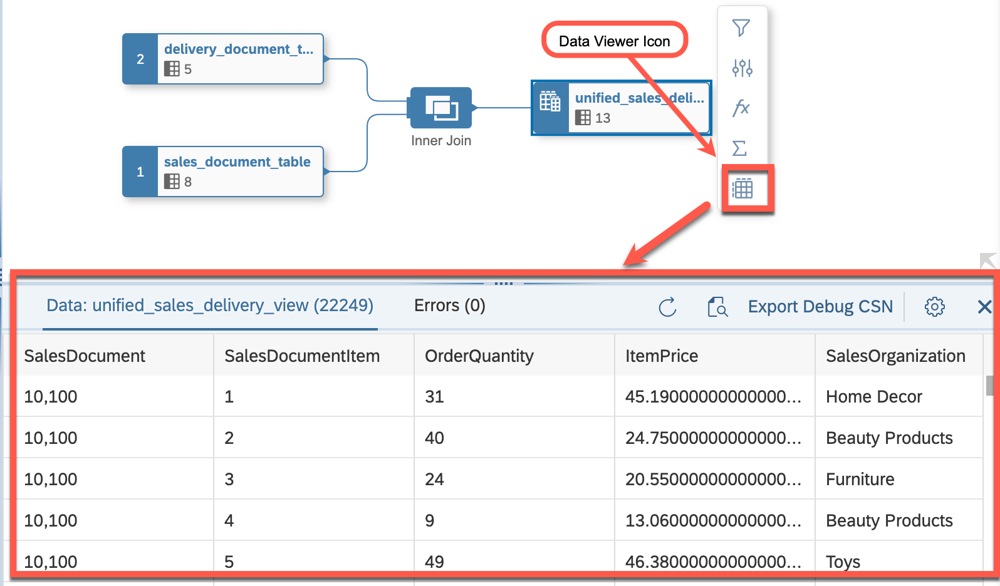

    > Note: Incase of **Delayed Data Viewing** message, scroll down and click on **View Data**, in order to load the data.
    > 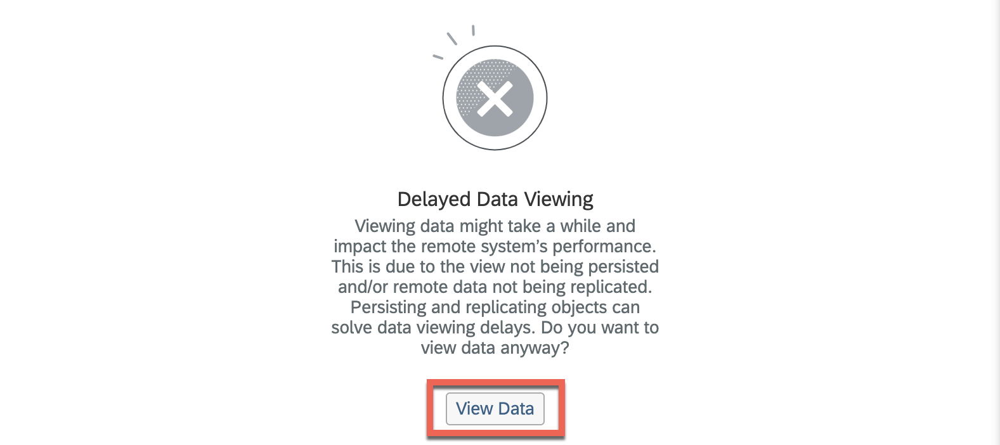

10. 👉 Save and deploy the **unified_sales_delivery_view** view

    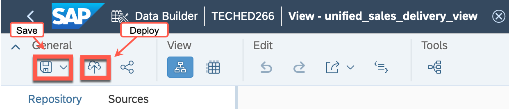

## Congratulations!

Congratulations on completing your Exercise 1! You have successfully created a new view of **"Unified Sales Delivery View"**!

Let's Continue to - [Exercise 2 - Creating a new analytical model for "Unified Sales Delivery View"](../ex2/README.md)

