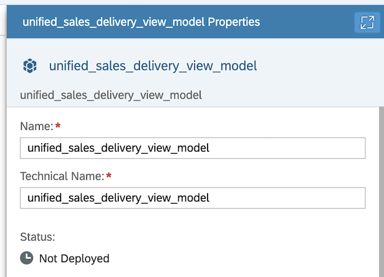

# Exercise 2 - Creating a new analytical model for "Unified Sales Delivery View"

This exercise focuses on creating a new analytical model called **"Unified Sales Delivery View Model"**. This model will be created by importing **"Unified Sales Delivery View"** to expose data for visualisation in SAP Analytics Cloud.

To complete this exercise, you will need to follow these steps:
1. Import all the measures and dimensions of  **"Unified Sales Delivery View"**.

2. Finalyse the analytical model by giving a name relevant to the **"Unified Sales Delivery View"**.

Your goal is to navigate through these steps and create an analytical model for **"Unified Sales Delivery View"** view that will be used for consumption. Best of luck!

### Step by Step Solution Guide

Refer to the provided solution below for a detailed, step-by-step guide on how to complete Exercise 3.

1. 👉 Go to **SAP Datasphere Data Builder** and create **New Analytical Model**

      

2. 👉 Open the **Views** from the Repository and drop the **"Unified Sales Delivery View"** view into the canvas.

      

3. 👉 In the **Select Properties To Be Copied**, check the **Add all attributes to analytic model** and **Add all measures to analytic model**, and Click on **Import**
      
      

4. 👉 Finalyse the analytical model by giving a name
    
    - Business Name: *unified_sales_delivery_view_model*
    - Technical Name: *unified_sales_delivery_view_model*

      

5. 👉 Save and deploy the **AM_Product_Sales_Country_Discount** analytical model, which will be further used in SAC to visualize data

      

## Summary

You've now created two views and one analytical model in SAP Datashpere. The analytical model "Unified Sales Delivery View Model" will be utilized by SAP Analytics Cloud to create a dashboard. This analytical model provides insights into the sales of products by country and the discounts offered, which can be used to inform strategic business decisions.

## Congratulations!

Congratulations on completing your Exercise 3! You have successfully created a new analytical model for "Unified Sales Delivery View Model"!

Let's Continue to - [Exercise 3 - Creating the Layout for the Sales Order Management Dashboard](../ex3/README.md)
