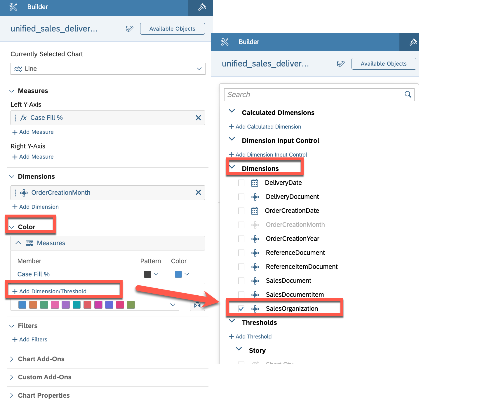

# Exercise 4 - Creating the Charts in Sales Order Management Dashboard for displaying Data

## Exercise 4.1 Creating the first Chart for displaying **Quantity per Product Category**

This exercise focuses on creating the first chart for displaying **"Short Qty per Sales Organization"** in a dashboard. The purpose of this chart is to provide an overview of the Quantities of various products with it's sales organization, allowing users to identify shortage of any item.

To complete this exercise, you will need to follow these steps:

1. Select the appropriate chart type for displaying Short Qty per Sales Organization, such as a bar chart or a pie chart.
2. Choose the appropriate visualization settings, such as the color scheme, labels, and axes, to ensure that the data is easy to read and visually appealing.
3. Select the appropriate fields from the data source to display Short Qty per Sales Organization.
4. Configure any necessary filters or sorting options to ensure that the data is displayed accurately and in the desired order.

Your objective is to create a chart that accurately displays the Short Qty per Sales Organization in a clear and visually appealing way, allowing users to quickly identify quantity of different sales organization and make informed decisions. Best of luck!

 

### Step by Step Solution Guide

After assigning the dataset, you can start building your first charts

1. 👉 Drag and drop from the left panel a **Chart** widget into the first container

   

2. 👉 Select the chart and add the following properties in a **Builder** on the right panel 
    - Dimensions: **SalesOrganization**

   

3. 👉 Add a new **Calculation** as a **Measure**
    - Type: **Calculated Measure**
    - Name: **Short Qty**
    - Formula: **["unified_sales_delivery_view_model":OrderQuantity"] - ["unified_sales_delivery_view_model":DeliveredQuantity]** (This will be the Analytic Model Name which you created in SAP Datashpere in Exercise 2)

   

4. 👉 Add a **Threshold****
    - Click on the Chart, scroll down to the Chart Add-Ons section and click on Threshold
    - Add Measure as **Short Qty**
    - Add **Range** (as shown in the screenshot below)
    - Click on **Apply**

   

5. 👉 Make Threshold visible on the Chart (refer to the screenshot)
    - In Measure section, click on **Threshold Icon** of **Short Qty** 
    - Click on **Show Threshold** and select **Story Defined**, then select **Short Qty**

   

6. 👉 Give some proper name ("Short Qty per Sales Organization") and your first chart is ready.

   

## Exercise 4.2 Creating another Chart for displaying **Discount per Product Category**

This exercise focuses on creating another chart for displaying **"Monthly Case Fill- 12 Month Trend"** in the dashboard. The purpose of this chart is to provide an overview of the sales organization with their Case Fill % of 12 months.

To complete this exercise, you will need to follow these steps:

1. Select the appropriate chart type for displaying quantity by product category, such as a bar chart or a pie chart.
2. Choose the appropriate visualization settings, such as the color scheme, labels, and axes, to ensure that the data is easy to read and visually appealing.
3. Select the appropriate fields from the data source to display discount by product category.
4. Configure any necessary filters or sorting options to ensure that the data is displayed accurately and in the desired order.
5. Optionally you can add a reference line for the average discount.

Your objective is to create a chart that accurately displays the Monthly Case Fill- 12 Month Trend in a clear and visually appealing way, allowing users to quickly identify trends and make informed decisions. Best of luck!
 
 

### Step by Step Solution Guide

Similar to the previous approach create another chart to visualize the **Discount** per Product Category**

1. 👉 Drag and drop from the left panel a **Chart** widget into the second container

   

2. 👉 Select the chart and add the following properties in a **Builder** on the right panel 
    - Currently Selected Chart: Line
    - Dimensions: **OrderCreationMonth**

   

3. 👉 Add a new **Calculation** as a **Measure**
    - Type: **Calculated Measure**
    - Name: **Case Fill %**
    - Formula: **[" [#Short Qty] / ["unified_sales_delivery_view_model1":OrderQuantity] \* 100"]** (This will be the Analytic Model Name which you created in SAP Datashpere in Exercise 2)

   

4. 👉 Add color to the chart by adding a dimension
    - In Builder, go the **Color** section and click on **Add Dimension/Threshold**
    - In the Dimensions drop down, select SalesOrganization

   

5. 👉 Format the styling of the **legends** in line chart
    - Right click on any of the legend, then click on **Edit Styling**
    - Again click on the legend to open Chart, Legends Styling View
    - In **Styling** View, under the legends section, select **Below Chart** from the drop down.

   

7. 👉 Give some proper name ("Monthly Case Fill: 12 Month Trend") and your second chart is ready.

   

## Congratulations!

Congratulations on completing your Exercise 5! You have successfully created Charts in Sales Order Management Dashboard for displaying Data!

Let's Continue to - [Exercise 5 - Creating the Table in Sales Order Management Dashboard for displaying Data](../ex5/README.md)