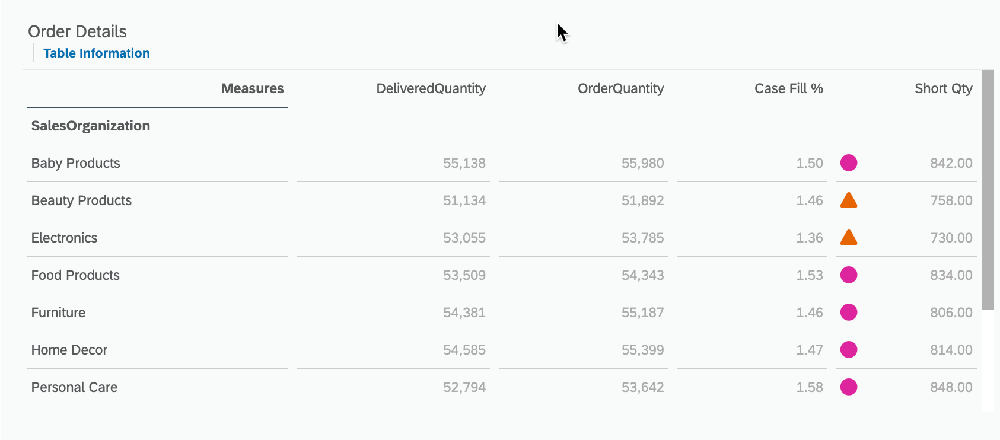

# Exercise 5 - Creating the Table in Sales Order Management Dashboard for displaying Data

This exercise focuses on creating the table for displaying **"Order Details"** in a dashboard. The purpose of this table is to provide an overview of the Quantities of various products with it's sales organization, allowing users to identify it's case fill percentage and shortage of any product.

To complete this exercise, you will need to follow these steps:

1. Select the table for displaying Order Details.
2. Choose the appropriate visualization settings, such as the color scheme, labels, and thresholds, to ensure that the data is easy to read and visually appealing.
3. Select the appropriate fields from the data source to display Order Details.
4. Configure any necessary filters or sorting options to ensure that the data is displayed accurately and in the desired order.

Your objective is to create a table that accurately displays the Order Details in a clear and visually appealing way, allowing users to quickly identify quantity of different sales organization and make informed decisions. Best of luck!

 

### Step by Step Solution Guide

After assigning the dataset, you can start building your first charts

1. 👉 Drag and drop from the left panel a **Chart** widget into the first container

   

2. 👉 Select the chart and add the following properties in a **Builder** on the right panel 
    - Dimensions: **SalesOrganization**

   

3. 👉 Add a new **Calculation** as a **Measure**
    - Type: **Calculated Measure**
    - Name: **Short Qty**
    - Formula: **["unified_sales_delivery_view_model":OrderQuantity"] - ["unified_sales_delivery_view_model":DeliveredQuantity]** (This will be the Analytic Model Name which you created in SAP Datashpere in Exercise 2)

   

4. 👉 Add a **Threshold****
    - Click on the Chart, scroll down to the Chart Add-Ons section and click on Threshold
    - Add Measure as **Short Qty**
    - Add **Range** (as shown in the screenshot below)
    - Click on **Apply**

   

5. 👉 Make Threshold visible on the Chart (refer to the screenshot)
    - In Measure section, click on **Threshold Icon** of **Short Qty** 
    - Click on **Show Threshold** and select **Story Defined**, then select **Short Qty**

   

6. 👉 Give some proper name ("Short Qty per Sales Organization") and your first chart is ready.

   

## Congratulations!

Congratulations on completing your Exercise 5! You have successfully created Table in Sales Order Management Dashboard for displaying Data!

Let's Continue to - [Exercise 6 - Creating **Input Controls** for the dashboard](../ex6/README.md)