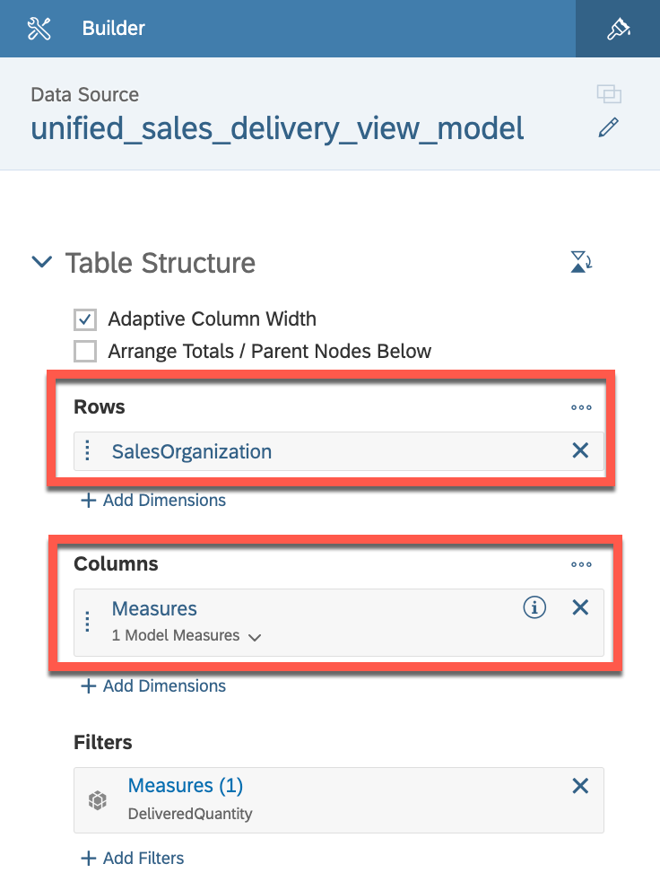

# Exercise 5 - Creating the Table in Sales Order Management Dashboard for displaying Data

This exercise focuses on creating the table for displaying **"Order Details"** in a dashboard. The purpose of this table is to provide an overview of the Quantities of various products with it's sales organization, allowing users to identify it's case fill percentage and shortage of any product.

To complete this exercise, you will need to follow these steps:

1. Select the table for displaying Order Details.
2. Choose the appropriate visualization settings, such as the color scheme, labels, and thresholds, to ensure that the data is easy to read and visually appealing.
3. Select the appropriate fields from the data source to display Order Details.
4. Configure any necessary filters or sorting options to ensure that the data is displayed accurately and in the desired order.

Your objective is to create a table that accurately displays the Order Details in a clear and visually appealing way, allowing users to quickly identify quantity of different sales organization and make informed decisions. Best of luck!

 

### Step by Step Solution Guide

After assigning the dataset, you can start building your first charts

1. 👉 Drag and drop from the left panel a **Table** widget into the third container

   

2. 👉 Select the table and add the following properties in a **Builder** on the right panel 
    - Rows: **SalesOrganization**
    - Columns: **Measures**

   

3. 👉 Add a new **Measures** from the **Filters** section
    - Click on Measures in Filter section.
    - Select **DeliveredQuantity**, **Case Fill %**, **Short Qty** and **OrderQuantity**

   

4. 👉 Add predefined Threshold to **Short Qty**
    - Right Click on Short Qty column in the table
    - Click on Threshold, then select Story Defined.
    - Select the Short Qty option

   

6. 👉 Adjust the table according to the panel and Give some proper name ("Order Details") and your table is ready.

   

## Congratulations!

Congratulations on completing your Exercise 5! You have successfully created Table in Sales Order Management Dashboard for displaying Data!

Let's Continue to - [Exercise 6 - Creating **Input Controls** for the dashboard](../ex6/README.md)